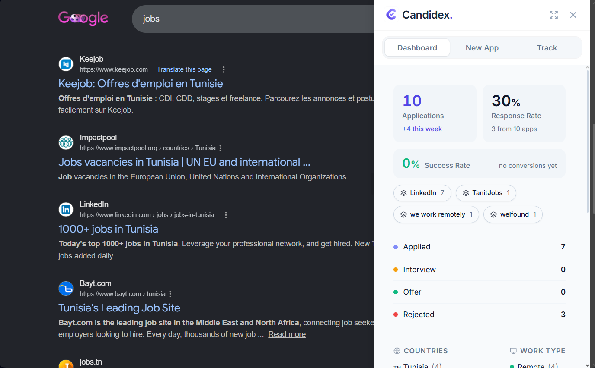

#  Candidex

An open-source browser extension for tracking job applications without giving your data to another hiring platform.

Candidex opens as a slide-out panel on top of the page you are browsing, lets you save applications in seconds, and keeps everything in your own Google Sheet.



## Why Candidex?

Job searching gets messy fast. You apply from LinkedIn, company career pages, job boards, newsletters, and random tabs you swear you will remember later.

Candidex gives you one lightweight place to track it all:

- Log applications without leaving the job page.
- See your application stats at a glance.
- Search old applications when a company finally replies.
- Update statuses like Applied, Interview, Offer, Rejected, or Withdrawn.
- Keep ownership of your data in your own Google Drive.

No backend. No hosted database. No account on a third-party job tracker.

## Features

- **Slide-out panel** - Use Candidex directly on top of job search pages.
- **Dashboard** - View totals, response rate, success rate, platforms, countries, work types, and recent applications.
- **New application form** - Save company, role, platform, links, country, work type, date, status, and notes.
- **Response tracking** - Search by company or role, then update status and interview date.
- **Google Sheets storage** - Your applications live in a Sheet created in your own Google Drive.
- **Open source** - The project is inspectable, forkable, and contribution-friendly.

## Browser Support

Candidex is built as a Chromium Manifest V3 extension.

| Browser | Status |
| --- | --- |
| Opera | Primary target |
| Chrome | Expected to work, Chromium-based |
| Edge / Brave / Vivaldi | Planned validation |
| Firefox | Future investigation |

Opera is the first browser target. Support for more browsers will be improved as the extension matures and contributors test more environments.

## Privacy

Candidex is built around a simple rule: your job search data should belong to you.

- Your applications are stored in your own Google Sheet.
- Candidex does not run a backend server.
- Candidex does not collect analytics or telemetry.
- Candidex does not use cookies or tracking pixels.
- Google OAuth runs through the browser extension identity flow.
- The OAuth `client_id` in `src/manifest.json` is public by design; there is no `client_secret`.

Read the full policy in `docs/privacy-policy.md`.

## Install From Source

Packaged store releases are not available yet. For now, you can install Candidex from source.

### Prerequisites

- Node.js 20+
- npm 10+
- Opera, Chrome, or another Chromium-based browser

### Build

```bash
git clone https://github.com/sebai-dhia/candidex.git
cd candidex
npm install
npm run build
```

### Load in Opera

1. Open `opera://extensions`.
2. Enable **Developer mode**.
3. Click **Load unpacked**.
4. Select `dist/candidex/browser`.
5. Pin or open Candidex from the browser toolbar.

### Load in Chrome or Other Chromium Browsers

1. Open your browser's extensions page, such as `chrome://extensions`.
2. Enable **Developer mode**.
3. Click **Load unpacked**.
4. Select `dist/candidex/browser`.

## For Contributors

Candidex is a small Angular extension project. Contributions are welcome, especially around browser compatibility, privacy-safe UX improvements, accessibility, and extension packaging.

### Development

```bash
npm run watch
```

After each rebuild, refresh the unpacked extension from your browser's extensions page.

### Scripts

```bash
npm run start     # Start Angular dev server
npm run build     # Build extension bundle
npm run watch     # Rebuild on file changes
npm run package   # Build and create extension zip
```

### Tech Stack

| Layer | Technology |
| --- | --- |
| Framework | Angular 22, signals, zoneless change detection |
| Extension | Chromium Manifest V3 |
| Storage | Google Sheets API v4 |
| Auth | Browser identity API + Google OAuth |
| Styling | Tailwind CSS 3 + SCSS |
| Icons | Lucide Angular |
| Typography | Inter, Plus Jakarta Sans |

### Project Structure

```txt
src/
|-- manifest.json              # Extension manifest
|-- background.js              # Service worker
|-- content.js                 # Slide-out panel injection
|-- app/
|   |-- app.ts                 # Root component
|   |-- core/
|   |   |-- constants/         # Shared option and country constants
|   |   |-- models/            # Shared TypeScript models
|   |   |-- services/          # Auth and Google Sheets services
|   |   `-- utils/             # Shared mapping helpers
|   `-- features/
|       |-- application/       # New application form
|       |-- dashboard/         # Dashboard view
|       `-- tracking/          # Response tracking view
`-- styles.scss                # Global styles
```

## Security Notes

- No source secrets are required.
- The extension requests only the permissions needed for auth, storage, active tab access, and UI injection.
- JavaScript runs from the extension bundle; no remote code is loaded.
- Application data stays in the user's Google account.

## Roadmap

- Improve packaged release flow.
- Validate more Chromium-based browsers.
- Investigate Firefox support.
- Improve accessibility and keyboard navigation.
- Add optional browser-store screenshots and documentation.

## License

[MIT](LICENSE)
